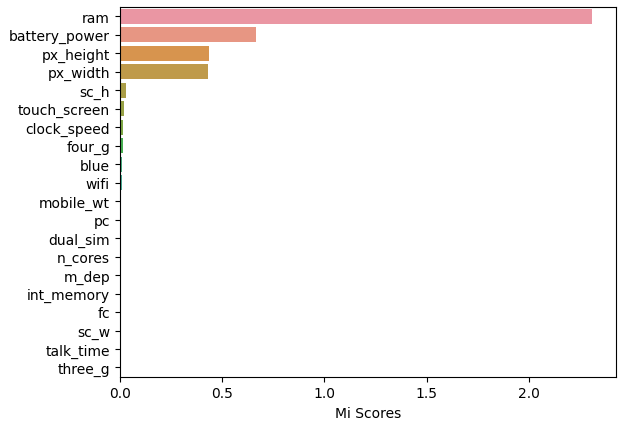

# 📱 Smartphone Price Classifier - Machine Learning Explainability

## 🎯 Problem Description

The Smartphone industry is growing, there are a lot of models in the market, but we don't know exactly which features are the most determinating at the time to put a price, and in which way they affect.

## 🔧 Proposed Solution

Development of a machine learning model that predict the price category of a smartphone. And creating model insights so that anyone without technical knowledge can understand how it works.

## 📊 Principal Results

- Most important features: RAM, Battery Power and Resolution
- Model accuracy: 89%
- Important correlations: PC & FC, 4G & 3G

## 🛠 Technologies Used

- Python 3.9+
- Pandas - Data Wrangling and Feature Engineering
- Scikit-learn Machine Learning
- Random Forest Classifier - Principal model
- Matplotlib/Seaborn - Visualizations
- Jupyter - Interactive Analisis

## 📈 Methodology

1. EDA: Exploratory Data Analysis
2. Machine Learning Explainability: Looking for insights and creating plots to see how a feature affects the model
3. Graphs with matplotlib: View data visually and intuitively
4. Feature Engineering: Creating derived variables
5. Modeling: Comparing multiple algorithms
6. Validation: Cross-validation and evaluation metrics

## 🔍 Conclusions and learnings

- The more RAM a phone has, the more expensive it can be sold.
- Low-resolution phones are usually sold cheaper.
- Most features have no real impact on the model.
- Creating a feature for resolution give us better predictions.

## 📞 Contact me

**Jesus Daniel Mendez Garatuza**

- LinkedIn: https://www.linkedin.com/in/daniel-mendez-0b7944358
- Email: danielmendez1708@hotmail.com

⭐ If you find this project useful, don't forget to give it a star.
